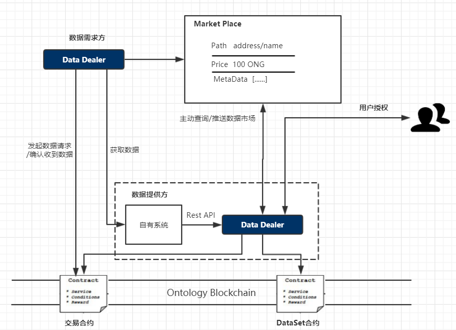

# Data Dealer

- [简介](#简介)
- [接口规范](#接口规范)
	- [账户管理](#账户管理)
		- [数据需求方注册](#数据需求方注册)
		- [数据提供方注册](#数据提供方注册)
		- [登录](#登录)
	- [数据需求方](#数据需求方)
		- [查询订单](#查询订单)
		- [购买数据](#购买数据)
		- [取消订单](#取消订单)
		- [获取数据提取信息](#获取数据提取信息)
	- [数据提供方](#数据提供方)
		- [发送加密数据提取信息](#发送加密数据提取信息)
		- [收取通证](#收取通证)
	- [工具接口](#工具接口)
		- [查询订单](#查询订单-1)
		- [数据加密](#数据加密)
		- [数据解密](#数据解密)
	- [存证接口](#存证接口)
        - [添加ontid属性](#添加ontid属性)
        - [获取DDO](#获取DDO)
        - [根据key获取存证](#根据key获取存证)
        

## 简介

在本体去中心化数据交换框架（DDXF）中，`Data Dealer` 作为中间层，用于降低数据需求方与数据提供方接入到 DDXF 的复杂度，让分散在全球的数据交换方能够便捷地在区块链上进行可信数据交换。

- 端到端数据加密。
- 实时化交易清算。
- 交易摩擦系数小。
- 广泛的开放市场。
- 可追溯的交易记录。



## 接口规范

### 账户管理

#### 数据需求方注册

1. 提交手机号码，密码
2. 返回 `ONT ID`

```text
url：/api/v1/ontid/register/demander/phone
method：POST
```

- 请求：

```json
{
    "phone":"86*15821703553",
    "password":"12345678"
}
```

| Field_Name | Type   | Description |
|:-----------|:-------|:------------|
| phone      | String | 手机号码    |
| password   | String | 设置密码    |

- 响应：

```json
{
    "action":"demanderRegister",
    "version":"v1",
    "code":0,
    "msg":"SUCCESS",
    "result": "did:ont:AR9cMgFaPNDw82v1aGjmB18dfA4BvtmoeN"
}
```

| Field_Name | Type   | Description                   |
|:-----------|:-------|:------------------------------|
| action     | String | 动作标志                      |
| version    | String | 版本号                        |
| code       | int    | 错误码                        |
| msg        | String | 成功为SUCCESS，失败为错误描述 |
| result     | String | 成功返回ontid，失败返回""     |

#### 数据提供方注册

1. 提交手机号码，密码
2. 返回 `ONT ID`

```text
url：/api/v1/ontid/register/provider/phone
method：POST
```

- 请求：

```json
{
    "phone":"86*15821703553",
    "password":"12345678"
}
```

| Field_Name | Type   | Description |
|:-----------|:-------|:------------|
| phone      | String | 手机号码    |
| password   | String | 设置密码    |

- 响应：

```json
{
    "action":"providerRegister",
    "version":"v1",
    "code":0,
    "msg":"SUCCESS",
    "result": "did:ont:AcrgWfbSPxMR1BNxtenRCCGpspamMWhLuL"
}
```

| Field_Name | Type   | Description                   |
|:-----------|:-------|:------------------------------|
| action     | String | 动作标志                      |
| version    | String | 版本号                        |
| code       | int    | 错误码                        |
| msg        | String | 成功为SUCCESS，失败为错误描述 |
| result     | String | 成功返回ontid，失败返回""     |

#### 登录

1. 提交号码，密码
2. 返回ontid

```text
url：/api/v1/ontid/login
method：POST
```

- 请求：

```json
{
    "phone":"86*15821703553",
    "password": "12345678"
}
```

| Field_Name |  Type  | Description |
|:----------:|:------:|:-----------:|
|   phone    | String |  手机号码   |
|  password  | String |  用户密码   |

- 响应：

```json
{
    "action":"login",
    "version":"v1",
    "code":0,
    "msg":"SUCCESS",
    "result": "did:ont:AR9cMgFaPNDw82v1aGjmB18dfA4BvtmoeN"
}
```

| Field_Name |  Type  |          Description          |
|:----------:|:------:|:-----------------------------:|
|   action   | String |           动作标志            |
|  version   | String |            版本号             |
|    code    |  int   |            错误码             |
|    msg    | String | 成功为SUCCESS，失败为错误描述 |
|   result   | String |   成功返回ontid，失败返回""   |

### 数据需求方

#### 购买数据

1. 提供买方，卖方，数据信息
2. 验证信息
3. 调用合约处理交易
4. 返回true

```text
url：/api/v1/data-dealer/buyer
method：POST
```

- 请求：

```json
{
	"dataDemander":"did:ont:AR9cMgFaPNDw82v1aGjmB18dfA4BvtmoeN",
	"password": "12345678",
	"dataProvider": "did:ont:AcrgWfbSPxMR1BNxtenRCCGpspamMWhLuO",
	"tokenContractAddress": "ong",
	"dataIdList": ["6b86b273ff34fce19d6b804eff5a3f5747ada4eaa22f1d49c01e52ddb7875b4b","d4735e3a265e16eee03f59718b9b5d03019c07d8b6c51f90da3a666eec13ab35","4e07408562bedb8b60ce05c1decfe3ad16b72230967de01f640b7e4729b49fce"],
	"priceList": [1,1,1],
	"waitReceiveEncListTime": 5000
}
```

|       Field_Name       |  Type   |                             Description                              |
|:----------------------:|:-------:|:--------------------------------------------------------------------:|
|      dataDemander      | String  |                           数据需求方ontid                            |
|        password        | String  |                            数据需求方密码                            |
|      dataProvider      | String  |                           数据提供方ontid                            |
|  tokenContractAddress  | String  |        同质化通证的合约地址，付款合约地址可以是ont、ong、OEP4        |
|       dataIdList       |  List   |                    所购数据的 `SHA256` 哈希值列表                    |
|       priceList        |  List   |                          所购数据的价格列表                          |
| waitReceiveEncListTime | Integer | 等待数据需求方从合约中取出提取数据所必须的加密信息列表的最大时间上限 |

- 响应：

```json
{
	"action":"buy",
	"version":"v1",
	"code":0,
	"msg":"SUCCESS",
	"result": {
	   "orderId": "22bb3e7b-e1f1-4c32-a646-6e0611cf78ed"
	}
}
```

| Field_Name |  Type  |          Description          |
|:----------:|:------:|:-----------------------------:|
|   action   | String |           动作标志            |
|  version   | String |            版本号             |
|   code     |  int   |            错误码             |
|    msg    | String | 成功为SUCCESS，失败为错误描述 |
|   result   | String |   成功返回orderId，失败返回""    |

#### 取消订单

1. 提供买方信息，订单ID
2. 验证信息
3. 调用合约取消交易
4. 返回true

```text
url：/api/v1/data-dealer/buyer/cancel
method：POST
```

- 请求：

```json
{
	"dataDemander":"did:ont:AR9cMgFaPNDw82v1aGjmB18dfA4BvtmoeN",
	"password": "12345678",
	"orderId": "22bb3e7b-e1f1-4c32-a646-6e0611cf78ed"
}
```

|  Field_Name  |  Type  |   Description   |
|:------------:|:------:|:---------------:|
| dataDemander | String | 数据需求方ontid |
|   password   | String | 数据需求方密码  |
|   orderId    | String |     订单ID      |

- 响应：

```json
{
	"action":"buyerCancel",
	"version":"v1",
	"code":0,
	"msg":"SUCCESS",
	"result": true
}
```

| Field_Name |  Type  |          Description          |
|:----------:|:------:|:-----------------------------:|
|   action   | String |           动作标志            |
|  version   | String |            版本号             |
|   code     |  int   |            错误码             |
|    msg     | String | 成功为SUCCESS，失败为错误描述 |
|   result   | String |   成功返回true，失败返回""    |

#### 获取数据提取信息

1. 提供买方信息，订单ID
2. 验证信息
3. 调用合约获取加密后的数据提取信息
4. 返回卖家填写信息

```text
url：/api/v1/data-dealer/buyer/receive
method：POST
```

- 请求：

```json
{
	"dataDemander":"did:ont:AR9cMgFaPNDw82v1aGjmB18dfA4BvtmoeN",
	"password": "12345678",
	"orderId": "22bb3e7b-e1f1-4c32-a646-6e0611cf78ed"
}
```

|  Field_Name  |  Type  |   Description   |
|:------------:|:------:|:---------------:|
| dataDemander | String | 数据需求方ontid |
|   password   | String | 数据需求方密码  |
|   orderId    | String |     订单ID      |

- 响应：

```json
{
	"action":"receiveMessage",
	"version":"v1",
	"code":0,
	"msg":"SUCCESS",
	"result": [
              	"[\"5dbdbbecb8243e948e7dc6f3cd9bed96\",\"04ad85664b51b9d4f42f0c5f0c97cf83a129ebdfb7ce18e032ebc7f27ae34757bb341029e7ac88ef52758de45a012c03b5234b7b3913ea05e9a7ef50ec0b783c09\",\"94a5ec821c9df2281c6c0adf1f2e5c68\"]",
              	"[\"b1bf6c4f2e7253df64cf1b739c5c0949\",\"0457182e8f95b54af15c3b17427349bf2599b0695f6e27e5f336d2e625e0743bab4a8cd9e10c2e5900b382e1c3861b66264fc4649e7331a1cc49dc7dfc2f199d62\",\"9e159fdbf61f14351b86e6c05ed7d1be\"]"
              ]
}
```

| Field_Name |  Type  |          Description          |
|:----------:|:------:|:-----------------------------:|
|   action   | String |           动作标志            |
|  version   | String |            版本号             |
|   code     |  int   |            错误码             |
|    msg     | String | 成功为SUCCESS，失败为错误描述 |
|   result   | String | 成功返回卖家填写信息，失败返回""    |

### 数据提供方

#### 发送加密数据提取信息

1. 提供卖方信息，订单ID，url，一次性密码
2. 获取买方信息
3. 将一次性密码和数据地址用买方公钥加密,并锁到只能合约
4. 返回true

```text
url：/api/v1/data-dealer/seller
method：POST
```

- 请求：

```json
{
	"dataProvider":"did:ont:AKRwxnCzPgBHRKczVxranWimQBFBsVkb1y",
	"password":"12345678",
	"orderId": "22bb3e7b-e1f1-4c32-a646-6e0611cf78ed",
	"encMessageList": ["http://data1.com","http://data2.com"]
}
```

|   Field_Name   |  Type  |                               Description                                |
|:--------------:|:------:|:------------------------------------------------------------------------:|
|  dataProvider  | String |                             数据提供方ontid                              |
|    password    | String |                              数据提供方密码                              |
|    orderId     | String |                                  订单id                                  |
| encMessageList |  List  | 加密消息列表，数据提供方在其中添加数据需求方用于提取数据所必须的加密信息 |

- 响应：

```json
{
	"action":"deliver",
	"version":"v1",
	"code":0,
	"msg":"SUCCESS",
	"result": true
}
```

| Field_Name |  Type  |          Description          |
|:----------:|:------:|:-----------------------------:|
|   action   | String |           动作标志            |
|  version   | String |            版本号             |
|   code     |  int   |            错误码             |
|    msg    | String | 成功为SUCCESS，失败为错误描述 |
|   result   | String |   成功返回true，失败返回""    |

#### 收取通证

```text
url：/api/v1/data-dealer/seller/token
method：POST
```

- 请求：

```json
{
	"dataProvider":"did:ont:AKRwxnCzPgBHRKczVxranWimQBFBsVkb1y",
	"password": "12345678",
	"orderId": "22bb3e7b-e1f1-4c32-a646-6e0611cf78ed"
}
```

|  Field_Name  |  Type  |   Description   |
|:------------:|:------:|:---------------:|
| dataDemander | String | 数据需求方ontid |
|   password   | String | 数据需求方密码  |
|   orderId    | String |     订单ID      |

- 响应：

```json
{
	"action":"getToken",
	"version":"v1",
	"code":0,
	"msg":"SUCCESS",
	"result": true
}
```

| Field_Name |  Type  |          Description          |
|:----------:|:------:|:-----------------------------:|
|   action   | String |           动作标志            |
|  version   | String |            版本号             |
|   code     |  int   |            错误码             |
|    msg    | String | 成功为SUCCESS，失败为错误描述 |
|   result   | String |   成功返回true，失败返回""    |

### 工具接口

#### 查询订单

1. 提供 `ontid`和用户类型。
2. 查询 `ontid` 所对应的订单列表。

```text
url：/api/v1/data-dealer/tools/orders/{type}?{ontid=}
method：GET
```

- 请求：


| Field_Name |  Type  |   Description   |
|:----------:|:------:|:---------------------------------------------------------------------:|
|  type   | Integer | 查询用户类型:0-需求方;1-提供方|
|  ontid  |  String | ontid |

- 响应：

```json
	{
	"action":"queryOrders",
	"version":"v1",
	"code":0,
	"msg":"SUCCESS",
	"result": [{
		"orderId": "22bb3e7b-e1f1-4c32-a646-6e0611cf78ed",
		"dataDemander": "did:ont:AR9cMgFaPNDw82v1aGjmB18dfA4BvtmoeN",
		"dataIdList": ["6b86b273ff34fce19d6b804eff5a3f5747ada4eaa22f1d49c01e52ddb7875b4b"],
		"buyDate": "2019-3-20",
		"state": "deliveredOnchain"
	}]
	}
```

| Field_Name |  Type  |          Description          |
|:----------:|:------:|:-----------------------------:|
|   action   | String |           动作标志            |
|  version   | String |            版本号             |
|   code     |  int   |            错误码             |
|    msg    | String | 成功为SUCCESS，失败为错误描述 |
|   result   | String | 成功返回orderList，失败返回"" |

#### 数据加密

1. 提供 `ONTID`，`kid` 以及 `password`。
2. 从区块链上查询指定公钥 `pk`。
3. 使用公钥 `pk` 对数据加密。

```text
url：/api/v1/data-dealer/tools/encrypt
method：POST
```

- 请求：

```json
{
  "ONTID": "did:ont:AR9cMgFaPNDw82v1aGjmB18dfA4BvtmoeN",
  "kid": 2,
  "message": "http://data1.com"
}
```

| Field_Name |  Type  | Description  |
|:----------:|:------:|:------------:|
|   ONTID    | String | 本体身份标识 |
|    kid     |  Int   |   公钥编号   |
|  message   | String |  待加密数据  |

- 响应：

```json
{
	"action":"encrypt",
	"version":"v1",
	"code":0,
	"msg":"SUCCESS",
	"result": "5dbdbbecb8243e948e7dc6f3cd9bed96"
}
```

| Field_Name |  Type  |          Description          |
|:----------:|:------:|:-----------------------------:|
|   action   | String |           动作标志            |
|  version   | String |            版本号             |
|   code     |  int   |            错误码             |
|    msg    | String | 成功为SUCCESS，失败为错误描述 |
|   result   | String | 成功返回解密数据，失败返回""  |

#### 数据解密

1. 提供数据提供方的 `ONTID`，`kid`。
2. 从区块链上查询指定公钥。
3. 从 `KeyStore` 中匹配对应的私钥。
4. 根据 `password` 对私钥进行解密，得到解密后的私钥 `sk`。
5. 使用私钥 `sk` 对数据进行解密。

```text
url：/api/v1/data-dealer/tools/decrypt
method：POST
```

- 请求：

```json
{
  "ONTID": "did:ont:AR9cMgFaPNDw82v1aGjmB18dfA4BvtmoeN",
  "kid": 2,
  "cipher": "5dbdbbecb8243e948e7dc6f3cd9bed96",
  "password": "password"
}
```

| Field_Name | Type   | Description    |
|:-----------|:-------|:---------------|
| ONTID      | String | ONT ID         |
| password   | String | 加密私钥的密码 |
| cipher     | String | 待解密的密文   |

- 响应：

```json
{
	"action":"decrypt",
	"version":"v1",
	"code":0,
	"msg":"SUCCESS",
	"result": "http://data1.com"
}
```

| Field_Name |  Type  |          Description          |
|:----------:|:------:|:-----------------------------:|
|   action   | String |           动作标志            |
|  version   | String |            版本号             |
|   code     |  int   |            错误码             |
|    msg    | String | 成功为SUCCESS，失败为错误描述 |
|   result   | String | 成功返回解密数据，失败返回""  |


### 存证接口

#### 添加ontid属性

1. 提供ontid，密码，属性
2. 验证信息，添加属性
3. 返回true

```text
url：/api/v1/ontid/attribute
method：PUT
```

- 请求：

```json
{
	"ontid":"did:ont:AR9cMgFaPNDw82v1aGjmB18dfA4BvtmoeN",
	"password":"12345678",
	"key": "key99",
	"valueType": "value99",
	"value": "value01"
}
```

| Field_Name| Type  |  Description         | 
| :-------: | :----:| :-------------------:|
|  ontid    | String|  需要添加属性的ontid |
|  password | String|  ontid的密码         |
|  key      | String|  属性的key           |
|  valueType| String|  属性的valueType     |
|  value    | String|  属性的value         |

- 响应：
```json
{
	"action":"addAttribute",
	"version":"v1",
	"code":0,
	"msg":"SUCCESS",
	"result": true
}
```

| Field_Name|     Type |   Description   | 
| :--------------: | :--------:| :------: |
|    action|   String|  动作标志  |
|    version|   String|  版本号  |
|    code|   int|  错误码  |
|    msg|   String|  成功为SUCCESS，失败为错误描述  |
|    result|   String|  成功返回true，失败返回""  |


#### 获取DDO

1. 提供ontid
2. 返回DDO

```text
url：/api/v1/ontid/ddo?{ontid=}
method：GET
```

- 请求：

```

| Field_Name|     Type |   Description   | 
| :--------------: | :--------:| :------: |
|    ontid|   String|  ontid  |

- 响应：
```json
{
	"action":"getDDO",
	"version":"v1",
	"code":0,
	"msg":"SUCCESS",
	"result": {
              	"Attributes": [],
              	"OntId": "did:ont:AR9cMgFaPNDw82v1aGjmB18dfA4BvtmoeN",
              	"Owners": [{
              		"Type": "ECDSA",
              		"Curve": "P-256",
              		"Value": "0206590ae715755f0f1fd235726957f8e11cd0b13b22c67c2404a5e3fd8d303b65",
              		"PubKeyId": "did:ont:AR9cMgFaPNDw82v1aGjmB18dfA4BvtmoeN#keys-1"
              	}]
              }
}
```

| Field_Name|     Type |   Description   | 
| :--------------: | :--------:| :------: |
|    action|   String|  动作标志  |
|    version|   String|  版本号  |
|    code|   int|  错误码  |
|    msg|   String|  成功为SUCCESS，失败为错误描述  |
|    result|   String|  成功返回DDO，失败返回""  |


#### 根据key获取存证

1. 提供ontid,存证的key
2. 返回存证

```text
url：/api/v1/ontid/key?{ontid=}&{key=}
method：GET
```

- 请求：


| Field_Name|     Type |   Description   | 
| :--------------: | :--------:| :------: |
|    ontid|   String|  ontid  |
|    key|   String|  存证的key  |

- 响应：
```json
{
	"action":"getDdoByKey",
	"version":"v1",
	"code":0,
	"msg":"SUCCESS",
	"result": {
              	"Type": "string",
              	"Value": "value123",
              	"Key": "key123"
              }
}
```

| Field_Name|     Type |   Description   | 
| :--------------: | :--------:| :------: |
|    action|   String|  动作标志  |
|    version|   String|  版本号  |
|    code|   int|  错误码  |
|    msg|   String|  成功为SUCCESS，失败为错误描述  |
|    result|   String|  成功返回存证，失败返回null  |